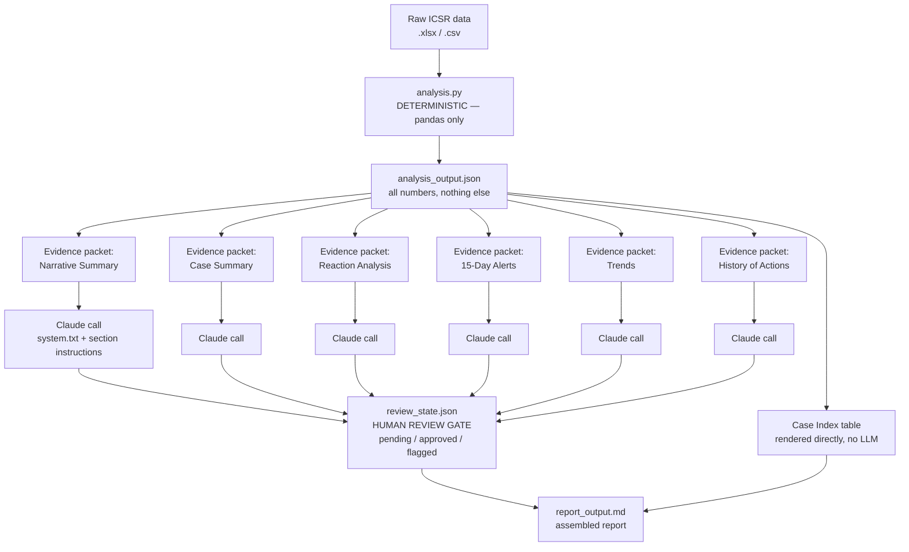

# Architecture

**Why it's shaped this way**

- **One box, one job.** `analysis.py` never calls an LLM; the LLM layer never
  touches the raw dataframe. That boundary is what makes every number in the
  report traceable back to a pandas operation instead of model arithmetic.
- **Six small Claude calls, not one big one.** Each section gets only the
  slice of `analysis_output.json` it needs (see `prompts/sections.py`).
  A section can't accidentally cite a figure it was never shown, and each
  prompt stays short and reviewable on its own.
- **The case index and cover page skip the LLM entirely** — they're a
  direct table render. There's nothing for a model to add there; using one
  anyway would just be a place for numbers to drift from source.
- **The review gate is a flat JSON file, not a database**, because Version 0
  only needs one human approving one run. `review_state.json` maps
  1:1 to sections in `report_output.md`, so a reviewer (or a thin UI reading
  this file) can flag a specific section without touching the others.
